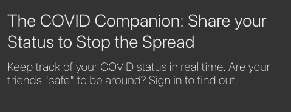
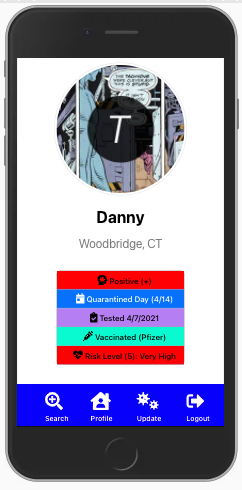
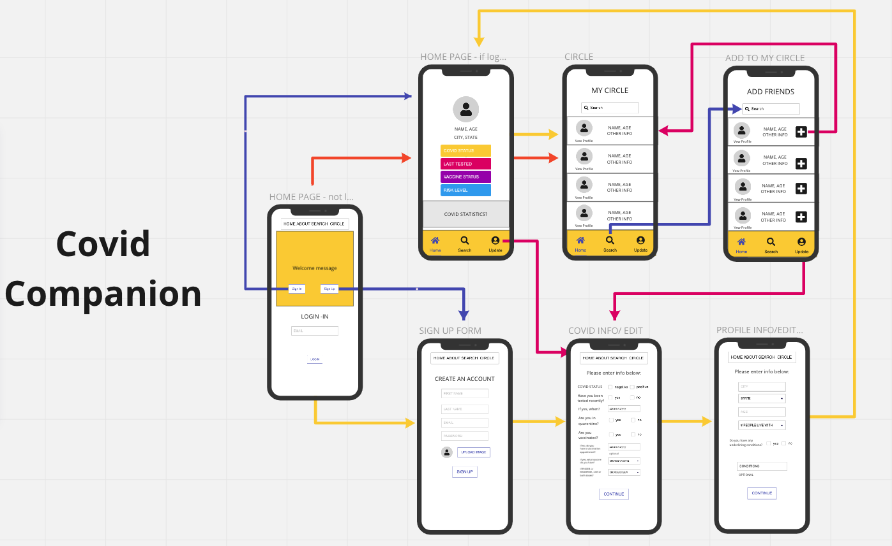
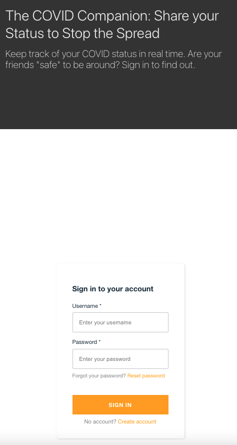
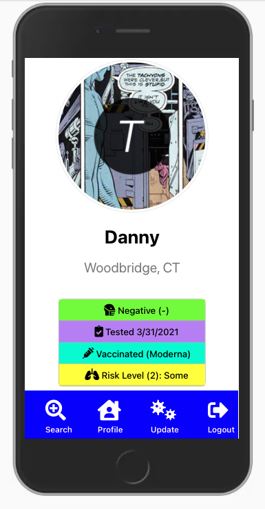
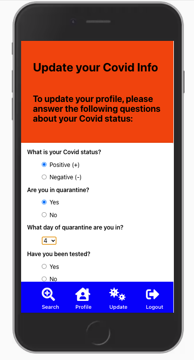
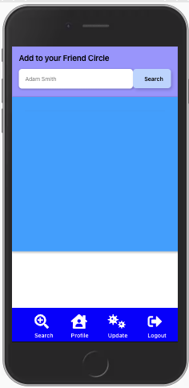
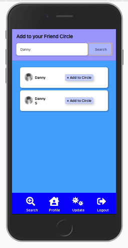

# COVID Companion





## Description

Covid Companion is an an app that uses React components, MongoDB, and AWS Amplify to share the most accurate information about each user and lets you share the details of your Covid status.

Have you been trying to make plans with friends but end up cancelling them when you remember that we’re in the middle of a global pandemic? Do you ask yourself, “how do I really know if they’re ‘safe ‘ to be around? Why meet up when I can text, call, or Facetime them from the safety of my home?” Enter Covid Companion.

Each profile displays whether or not that person is Covid positive or negative, whether or not they’re in quarantine and, if so, how long they’ve been in quarantine, whether or not they’ve been tested and, if so, the date of their last test, whether or not they’ve been vaccinated and, if so, which vaccine, and their exposure risk level based on a preexisting condition.
Being able to see a person’s current Covid status takes the guesswork out of planning pandemic ‘playdates.’ Stop the spread and share your stats.

View the deployed app [here](https://covid-companion21.herokuapp.com/)

## Table of Contents

- [Technologies Used](#technologies-used)
- [Wireframe & Webflow](#wireframe-webflow)
- [MVC Structure ](#mvc-structure)
- [User Story](#user-story)
- [Acceptance Criteria](#acceptance-criteria)
- [Presentation Requirements](#presentation-requirements)
- [Installation](#installation)
- [Credits](#credits)
- [Contributors](#contributors)
- [License](#license)

## Technologies Used

- Node
- React
- Express
- MongoDB
- Mongoose
- MongoDB Atlas
- Axios
- Amplify (aws)
- Tachyon
- Miro
- Moment
- Heroku

## Wireframe & Webflow




### MVC Structure

```
.covid-companion
|
├── client
|    └── public
|         ├── favicon.ico
|         ├── index.html
|         ├── logo192.png
|         ├── logo512.png
|         ├── manifest.json
|         └── robots.txt
|    └── src
|        └── components
|               ├── AvatarBio.js
|               ├── CardBtn.js (+)
|               ├── CovidInfo.js
|               ├── editQuestions.js
|               ├── Friend.js
|               ├── Footer.js
|                   ├──── footer.css
|                   └──── Footer.js
|               ├── FriendCard.js
|               ├── FriendCircle.js
|               ├── Navbar.js
|                   ├──── navbar.css
|                   └──── Navbar.js
|               ├── Question.js
|               ├── questions.js
|               ├── SearchBar.js
|               ├── SearchResults.js
|               ├── Title.js
|               ├── UpdateQuestions.js
|               ├──
|               ├──
|               ├──
|               ├──
|               └──
│        └── pages
|               ├──── Home-About.js
|               ├──── Profile.js
|               ├──── Questionnaire.js
|               ├──── SearchFriends.js
|               └──── UpdateProfile.js
|
|        ├── App.js
|        ├── aws-exports.js
|        ├── index.js
|        └── index.css
|
├── amplify
├── controllers
│     └── posts.js
│     └── users.js
├── models
│     └── User.js
├── routes
│     └── posts.js
├── scripts
|     └── seedDB.js
|
├── test-formats (raw html formats)
├── .env
├── node_modules
├── deleteUsers.js
├── .gitignore
├── (.eslintignore)
├── .eslintrc.json
|
├── package.json
├── (package-lock.json)
|
├── server.js
│

```

### Presentation Requirements

View the presentation [here](https://docs.google.com/presentation/d/1J1-mffYfRNxUSWVwDAV-BMaHv-8ddj8R5yVRCZolYfs/edit?usp=sharing)

- Elevator pitch: a one minute description of your application

- Concept: What is your user story? What was your motivation for development?

- Process: What were the technologies used? How were tasks and roles broken down and assigned? What challenges did you encounter? What were your successes?

- Demo: Show your stuff!

- Directions for Future Development

- Links to to the deployed application and the GitHub repository. Use this guide for deploying your application to Heroku if you need a reminder on how to deploy!

## Installation

1. Fork repo and run `npm run start` in the root folder to run the frontend and the backend.









## Credits

- [Miro](https://miro.com/app/board/o9J_lcLWy3k=/)
- [Tachyon](http://tachyons.io/components/)
- [Who's at higher risk of serious symptoms](https://www.mayoclinic.org/diseases-conditions/coronavirus/in-depth/coronavirus-who-is-at-risk/art-20483301)
- [US COVID-19 Risk Level Based on Conditions](https://www.npr.org/sections/health-shots/2020/04/01/824874977/underlying-health-disparities-could-mean-coronavirus-hits-some-communities-harde)
- [Common immunodeficiency diseases](https://www.google.com/search?q=common+immunodeficiency+diseases&rlz=1C5CHFA_enUS728US728&sxsrf=ALeKk02FGsMH2pKumokGimguNMjzBtUKtQ%3A1617756260267&ei=ZABtYI7lD6WKggejspDwBw&oq=immunocompromised+conditions+list&gs_lcp=Cgdnd3Mtd2l6EAEYBTIHCCMQsAMQJzIHCAAQRxCwAzIHCAAQRxCwAzIHCAAQRxCwAzIHCAAQRxCwAzIHCAAQRxCwAzIHCAAQRxCwAzIHCAAQRxCwAzIHCAAQRxCwAzIHCAAQsAMQQ1AAWABgjYoBaAFwAngAgAHhFIgB4RSSAQM5LTGYAQCqAQdnd3Mtd2l6yAEKwAEB&sclient=gws-wiz)
- [Chronic Respiratory Diseases](https://www.google.com/search?q=chronic+respiratory+diseases&rlz=1C5CHFA_enUS728US728&sxsrf=ALeKk038PWoPm9zdjnsDmriiMwOHRUmyOw%3A1617754745451&ei=efpsYNKBG8G9ggfKjo-4CA&oq=chronic+respiratory+diseases&gs_lcp=Cgdnd3Mtd2l6EAMyAggAMgIIADICCAAyAggAMgIIADICCAAyAggAMgIIADICCAA6BwgjELADECc6BwgAEEcQsAM6BwgAELADEEM6BwgAELEDEEM6BAgAEEM6BwgAEIcCEBRQgIQBWMeSAWDpmgFoA3ACeACAAc8KiAGNEJIBBzYuMi43LTGYAQCgAQGqAQdnd3Mtd2l6yAEKwAEB&sclient=gws-wiz&ved=0ahUKEwiSor6H7urvAhXBnuAKHUrHA4cQ4dUDCA0&uact=5)
- [Cardiovascular Diseases](https://www.google.com/search?q=cardiovascular+diseases&rlz=1C5CHFA_enUS728US728&oq=cardiovascular+diseases&aqs=chrome..69i57j0l2j0i20i263j0l3j0i20i263j0l2.3698j0j7&sourceid=chrome&ie=UTF-8)
- [Chronic Renal Diseases](https://www.google.com/search?q=chronic+renal+diseiases&rlz=1C5CHFA_enUS728US728&oq=chronic+renal+diseiases&aqs=chrome..69i57j0i13j0i10i22i30l2j0i5i10i13i30j0i5i13i30j0i8i10i13i30j0i8i13i30l3.3775j0j7&sourceid=chrome&ie=UTF-8)
- [Covid Pandemic Mortality Risk Estimator](https://www.economist.com/graphic-detail/covid-pandemic-mortality-risk-estimator)
- [How to Connect AWS Amplify with React Native Application](https://hackernoon.com/how-to-connect-aws-amplify-with-react-native-application-8t1p3twj)
- [Customizing the Built-in Sign-in and Sign-up Webpages](https://docs.aws.amazon.com/cognito/latest/developerguide/cognito-user-pools-app-ui-customization.html)
- [Customizing AWS Amplify Signin Page in React](https://medium.com/@kavyababu/customizing-aws-amplify-signin-page-in-react-94d95983d0c)

## Contributors

[Bruno Borges](https://github.com/BrunoBBorges)
[Ryan Curtin](https://github.com/rpc08002)
[Cris Franco](https://github.com/Cris-Franco)
[Julie Ann Iwinski](https://github.com/JulieAnnI)
[Pete Izzo](https://github.com/peter-izzo)
[Danny Smooke](https://github.com/dsmooke)

A HUGE special thanks to [Chris Bonafacio](https://github.com/chrisbonifacio) and [Nathan Sartain](https://github.com/NatePad) for helping with AWS Amplify and authentication.

## License

[MIT](MITLicense.txt)

---

© 2021 Trilogy Education Services, LLC, a 2U, Inc. brand. Confidential and Proprietary. All Rights Reserved.
